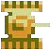

# Tank Hero

### Author

Yuyang LIN


### Structure

The game consists of 6 states with the implementation of state pattern, including StartState, PrepState, GameState, LostState, WinState, InfoState, which have a base class of State. And Scyyl7Engine can know which state is on and switch from different states. 

```
1. StartState: The start page of the game for users to choose from the menu. 
2. PrepState: The state for users to choose game theme and enter user name.
3. GameState: The game-playing state with 2 levels.
4. LostGame: The state to display after users fail the game.
5. WinState: The state to display after users win the game.
6. InfoState: The instructions for the game.
```


### Game Details

The users can use key arrows to control the tank object and they can press space to shoot the enemy: ghosts and monsters .

If users want to exit and save the game, they can press "s" to quit the game. When they want to continue for the next time, they can load from the start page.

If the user gets a high score, their score will be stored in a txt file.


